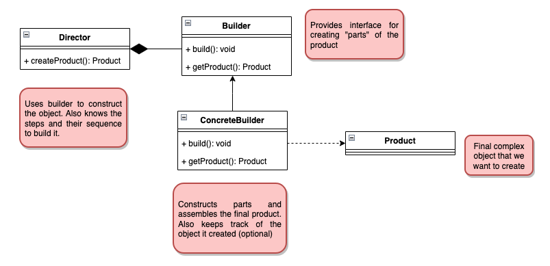

# Builder

To understand how builder works, let's understand which type of problem it solves.
We have a requirement for the objects to be immutable. Ex:

```java
class Product {
    public Product(int weight, double price, int shipVolume, int shipCode) {
        //initialization    
    }
}
```

An immutable class is a class that its state and properties cannot be changed
once it is created. A good example of an immutable class is the `String` class.
As we can see with the Product class, when writing immutable classes, we often
end up with a constructor with a lot of parameters, because all the information
must be provided on the constructor. But this is a bad coding practice, as
having a lot of parameters can cause confusion on which one is necessary, and
at what order. And the problem is even worse when the types are very similar or
even the same (for example, a lot of int's and double's). The only way to find
out what is each parameter is by reading the documentation.

Now, before heading to how the solution works, let's look at a different problem.
On the next example, we have 2 classes, but one of them receives the other one
on the constructor:

```java
class Address {
    public Address (String houseNumber, String street, ...) {
        //initialization
    }
}
```

```java
class User {
    public Address (String name, Address address, LocateDate birthdate, List<Role> roles) {
        //initialization
    }
}
```

By facing it as parts needed for construction of the User object, the builder
really comes in hand. Whenever we need multiple parts to build a single object, 
it is a good approach to use this design pattern. The second point is that
if you look at the constructor, we must first create the objects before passing
it on the User constructor. So there are certain steps to follow before using
the User object, again making it a good use case for the Builder pattern.

To sum up, what is a builder?

- We have a complex process to construct an object involving multiple steps,
then builder is a good approach.
- In builder, we remove the logic related to object construction from "client"
code by abstract it in separate classes.



There are a few steps to use the Builder pattern:

1. Start by creating a builder
   1. Identify the parts of the product and provide methods to create those 
   parts. Can also be referred to as the steps.
   2. Provide a method to "assemble", or build, the object
   3. Must provide a way/method to get the fully built object out. _Optionally_
   the builder can keep track of the object that has been built. So the same
   can return again in the future
2. A director can be a separate class or the client can play the role of the
director.